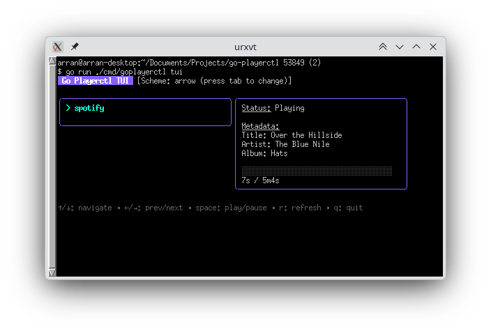

# go-playerctl

A Go port of Playerctl for controlling MPRIS-compatible media players over D-Bus.

> Status: **Go-complete baseline**. Core CLI, daemon, and library are implemented in Go.

## Installation

You can download pre-compiled binaries for your platform from the [GitHub Releases page](https://github.com/arran4/go-playerctl/releases).

Alternatively, you can install from source using `go install`:

```bash
go install github.com/arran4/go-playerctl/cmd/goplayerctl@latest
```

## Quick start

```bash
go test ./...
goplayerctl --version
goplayerctl daemon --version
```

## CLI usage (`goplayerctl`)

```bash
goplayerctl [flags] <command>
```

### Supported flags

- `--player` comma-separated instance list (for example `vlc,spotify`)
- `--ignore-player` comma-separated instance ignore list
- `--all-players` run query/action for all discovered players
- `--list-all` print discovered player instances
- `--format` output format using Go template syntax
- `--follow` poll and print changes for query commands
- `--follow-interval` polling period for `--follow`
- `--tui-scheme` TUI control scheme (arrow, vim, winamp, emacs)
- `--version` print CLI version string

### Supported commands

- `play`
- `pause`
- `play-pause` / `playpause`
- `next`
- `previous`
- `status`
- `metadata`
- `loop [status]`
- `shuffle [on|off|toggle]`
- `volume [level]`
- `position [offset]`
- `rate [level]`
- `open <uri>`
- `playlist`
- `tracklist`

### Examples

```bash
# list players
goplayerctl --list-all

# query status for one player
goplayerctl --player vlc status

# query metadata for all players with formatted output
goplayerctl --all-players --format '{{ .player }}: {{ default .title "(none)" }}' metadata

# query metadata for a player showing artist, album, and title
goplayerctl --player spotify --format '{{ default .artist "Unknown Artist" }} - {{ default .album "Unknown Album" }} - {{ default .title "Unknown Title" }}' metadata

# follow status changes
goplayerctl --player spotify --follow status

# print active playlist details via template
goplayerctl --format 'Active Playlist: {{ .activePlaylistName }} ({{ .playlistCount }} total)' metadata

# print out all tracks in the tracklist
goplayerctl --format '{{ range .tracklist }}{{ .title }} by {{ .artist }}{{ "\n" }}{{ end }}' metadata

# print out all available playlists
goplayerctl --format '{{ range .playlists }}Playlist: {{ .name }}{{ "\n" }}{{ end }}' metadata
```

## TUI usage (`goplayerctl tui`)



```bash
go run ./cmd/goplayerctl tui [flags]
```

## Daemon usage (`goplayerctl daemon`)

```bash
goplayerctl daemon [flags]
```

### Supported flags

- `--once` refresh and print discovered players once, then exit
- `--refresh-interval` refresh interval for daemon loop
- `--version` print daemon version string

### D-Bus service surface (current)

When not in `--once` mode, daemon attempts to export:

- Bus name: `org.mpris.MediaPlayer2.playerctld`
- Object path: `/org/mpris/MediaPlayer2`
- Interface: `com.github.altdesktop.playerctld`

Methods/properties currently exposed by the Go port:

- methods: `Shift`, `Unshift`
- signals emitted: `ActivePlayerChangeBegin`, `ActivePlayerChangeEnd`
- properties/accessors: `PlayerNames`, `ActivePlayer`

## Signals / Event Subscriptions
If you want to observe asynchronous D-Bus events for a specific player connection (like `TrackAdded` or `Seeked` or `NameOwnerChanged`), you can consume signals using the exported `.Events()` channel on the `Player` struct:

```go
events := p.Events()
for sig := range events {
    fmt.Printf("Received signal: %s from %s\n", sig.Name, sig.Sender)
}
```

## Library usage (`pkg/playerctl`)

The package provides:

- enums and parsers (`PlaybackStatus`, `LoopStatus`, `Source`)
- typed errors (`ErrPlayerNotFound`, `InvalidCommandError`, `FormatError`)
- `Player` with MPRIS property getters/commands/metadata helpers
- `PlayerManager` for discovery/filtering/ordering helpers
- `Formatter` backed by Go `text/template`

### Minimal example

```go
package main

import (
    "fmt"
    "log"

    "github.com/arran4/go-playerctl/pkg/playerctl"
)

func main() {
    p, err := playerctl.NewPlayer("vlc", playerctl.SourceDBusSession)
    if err != nil {
        log.Fatal(err)
    }
    defer p.Close()

    status, err := p.PlaybackStatus()
    if err != nil {
        log.Fatal(err)
    }
    fmt.Println(status)
}
```

## Formatting model

`Formatter` uses Go `text/template` and supports helper functions:

- `lc`, `uc`
- `default`
- `duration`
- `markup_escape`
- `emoji`
- `trunc`
- `add`, `sub`
- `has_playlist`
- `has_tracklist`

Example:

```bash
goplayerctl --player spotify --format '{{ emoji .status }} {{ default .title "(none)" }}' status

# Only show playlist if it exists
goplayerctl --format '{{ if has_playlist .playlistCount }}Active: {{ .activePlaylistName }}{{ else }}No playlist{{ end }}' metadata
```

## Documentation and references

- API Reference: [pkg.go.dev/github.com/arran4/go-playerctl](https://pkg.go.dev/github.com/arran4/go-playerctl)
- Man page source: `doc/playerctl-go.1.md`

## Development

```bash
go test ./...
go test -race ./...
```
